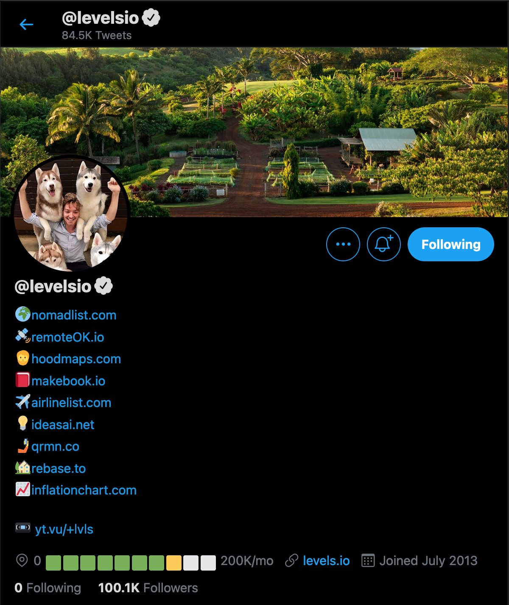
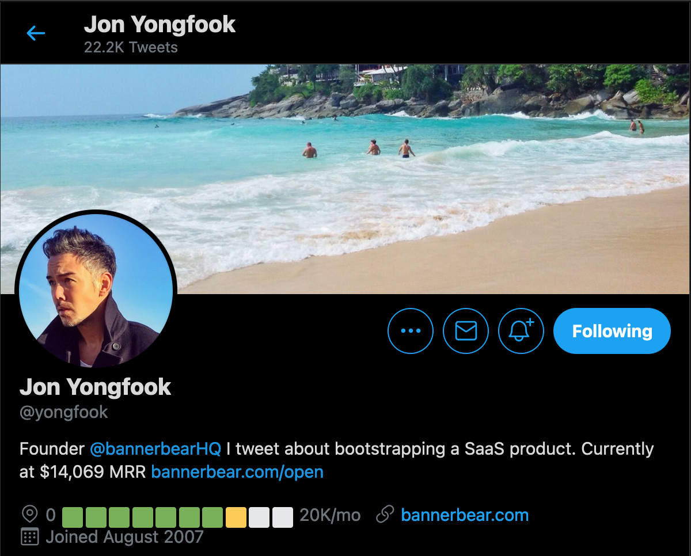
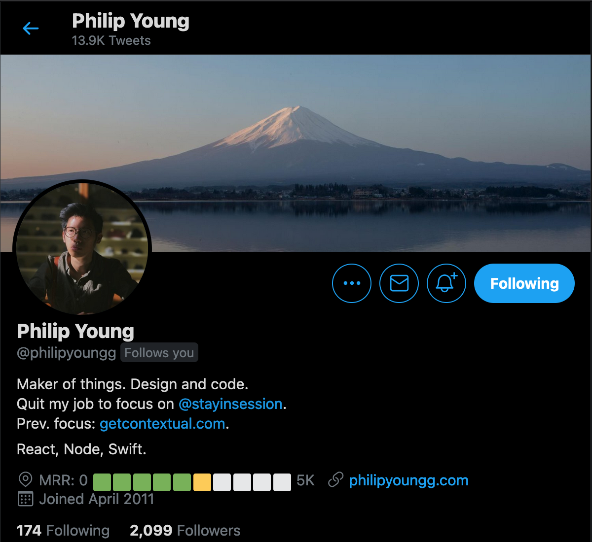

# Twitter Stripe MRR

<!-- PROJECT LOGO -->
<br />
<p align="center">
  <a href="https://github.com/jsjoeio/twitter-stripe-mrr">
    
  </a>

  <h3 align="center">Twitter Stripe MRR</h3>

  <p align="center">
  Node script to calculate your total monthly revenue from Stripe (using payouts) and update your Twitter bio (location) based on your MRR goal
    <br />
    <a href="https://github.com/jsjoeio/twitter-stripe-mrr"><strong>Explore the docs »</strong></a>
    <br />
    <br />
    <a href="https://github.com/jsjoeio/twitter-stripe-mrr">View Demo</a>
    ·
    <a href="https://github.com/jsjoeio/twitter-stripe-mrr/issues">Report Bug</a>
    ·
    <a href="https://github.com/jsjoeio/twitter-stripe-mrr/issues">Request Feature</a>
  </p>
</p>

<!-- TABLE OF CONTENTS -->
<details open="open">
  <summary><h2 style="display: inline-block">Table of Contents</h2></summary>
  <ol>
    <li>
      <a href="#about-the-project">About The Project</a>
      <ul>
        <li><a href="#built-with">Built With</a></li>
      </ul>
    </li>
    <li>
      <a href="#getting-started">Getting Started</a>
      <ul>
        <li><a href="#prerequisites">Prerequisites</a></li>
        <li><a href="#installation">Installation</a></li>
      </ul>
    </li>
    <li><a href="#usage">Usage</a></li>
    <li><a href="#deployment">Deployment</a></li>
    <li><a href="#roadmap">Roadmap</a></li>
    <li><a href="#contributing">Contributing</a></li>
    <li><a href="#license">License</a></li>
    <li><a href="#help">Help</a></li>
    <li><a href="#acknowledgements">Acknowledgements</a></li>
  </ol>
</details>

<!-- ABOUT THE PROJECT -->

## Twitter Stripe MRR

Node script that calculates your total monthly revenue from Stripe (using payouts) and updates your Twitter bio (location) based on your MRR goal.

---

Inspired by [this tweet](https://twitter.com/yongfook/status/1373969868605644803?s=20)


<p>
  <small>
    <a href="https://twitter.com/yongfook/status/1373969868605644803?s=20">Link to tweet</a>
  </small>
</p>

<p>
  <small>
    Image generated thanks to
    <a href="https://tweetpik.com/yongfook/status/1373969868605644803">Tweetpik.</a>
  </small>
</p>

### Built With

- [Node.js](https://nodejs.org/en/)
- [Stripe API](https://stripe.com/docs/api)
- [Twitter API](https://developer.twitter.com/en/docs/twitter-api)

<!-- GETTING STARTED -->

## Getting Started

To use this script locally, make sure you have the prerequisites and then follow the installation steps.

### Prerequisites

- Node and npm(download [here](https://nodejs.org/en/download/))
- Stripe API key (get from Dashboard [here](https://dashboard.stripe.com/apikeys))
- Twitter API keys
  - Sign up on [Developer Portal](https://developer.twitter.com/en/portal/dashboard)
  - Either in your project app or Standalone app, click the Key icon
  - Get the Consumer Keys (key and secret)
  - Get the Access token and secret

### Installation

1. Clone the repo
   ```sh
   git clone https://github.com/jsjoeio/twitter-stripe-mrr.git
   ```
2. Install dependencies
   ```sh
   yarn install
   ```
3. Duplicate the env.example file
   ```sh
   cp .env.example .env
   ```
4. Add your API keys to `.env`
5. Modify the script as needed
6. Run script
   ```sh
   node index.js
   ```
   <!-- USAGE EXAMPLES -->

## Usage

Here are a couple screenshots of people using this in the indie hacker space:

<p float="left" align="middle">
  <a href="https://twitter.com/levelsio">
   
  </a>
  <a href="https://twitter.com/yongfook">
   
  </a>
  <a href="https://twitter.com/philipyoungg">
   
  </a>
</p>

## Deployment

(Coming soon)

Will look into deploying using GitHub Actions scheduler

<!-- ROADMAP -->

## Roadmap

- [ ] Video tutorial on running project locally
- [ ] Video tutorial on deploying the project

<!-- CONTRIBUTING -->

## Contributing

Contributions are what make the open source community such an amazing place to be learn, inspire, and create. Any contributions you make are **greatly appreciated**.

1. Fork the Project
2. Create your Feature Branch (`git checkout -b feature/AmazingFeature`)
3. Commit your Changes (`git commit -m 'Add some AmazingFeature'`)
4. Push to the Branch (`git push origin feature/AmazingFeature`)
5. Open a Pull Request

<!-- LICENSE -->

## License

Distributed under the MIT License. See [`LICENSE`](./LICENSE) for more information.

<!-- CONTACT -->

## Help

Need help? Open an issue! Or tweet @ me [@jsjoeio](https://twitter.com/jsjoeio)

<!-- ACKNOWLEDGEMENTS -->

## Acknowledgements

- [@philipyoungg for the emoji in bio inspiration](https://twitter.com/philipyoungg)
- [@yongfook for the idea](https://twitter.com/yongfook)
- [Sreeram Venkitesh for the Twitter API refresher](https://dev.to/deta/how-i-used-deta-and-the-twitter-api-to-update-my-profile-name-with-my-follower-count-tom-scott-style-l1j)
- [Jake Feasel for the `kFormatter` function on Stack Overflow](https://stackoverflow.com/a/9461657/3015595)
- [Matthew Mullin for Stripe monthly revenue help on Stack Overflow](https://stackoverflow.com/a/53775391/3015595)
- [Leo Nagano for writing up a recap on Indie Hackers](https://www.indiehackers.com/post/mrr-progress-bar-in-profile-is-it-becoming-viral-47dcb1edad)
